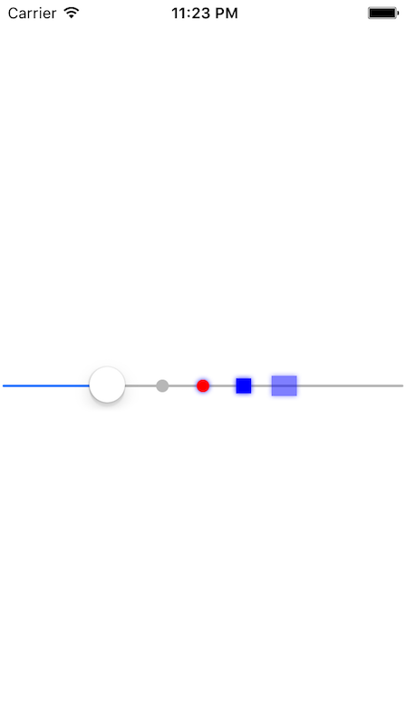

Simple and light weight slider with ticker

# Appearance


# Install

Create Podfile as below

```
use_frameworks!
platform :ios, '8.0'
pod 'FLTickerSlider', :git => 'https://github.com/fileio/FLTickerSlider.git'
```

then run

```
$ pod install
```

# Usage

```swift
// create FLTickerSlider instance
let tickerSlider = FLTickerSlider.init(frame: CGRectMake(0, self.view.frame.size.height / 2, self.view.frame.size.width, 40))
self.view.addSubview(tickerSlider)

// create shadow
let shadow = FLSliderTick.Shadow(color: UIColor.blueColor(),
				 offset: CGSizeMake(0.0, 0.0),
				 opacity: 0.8,
				 radius: 2.0)

// create tickers
let tick0 = FLSliderTick(offset: 0.4)
let tick1 = FLSliderTick(offset: 0.5,
			 color: UIColor.redColor(),
			 shadow: shadow)
let tick2 = FLSliderTick(offset: 0.6,
			 color: UIColor.blueColor(),
			 shadow: shadow,
			 width: 12,
			 height: 12,
			 shape: FLSliderTick.Shape.Rect)
let tick3 = FLSliderTick(offset: 0.7,
			 color: UIColor.blueColor(),
			 shadow: shadow,
			 width: 20,
			 height: 16,
			 shape: FLSliderTick.Shape.Rect)
tick3.alpha = 0.5

// add tickers to FLTickerSlider
tickerSlider.setTickers([
    tick0,
    tick1,
    tick2,
    tick3
    ])
```

# LICENSE

FLTickerSlider is available under the MIT license. See the LICENSE file for more info.
